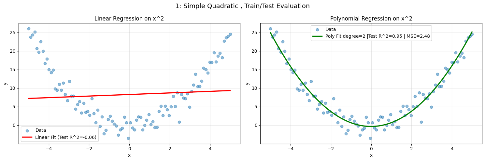
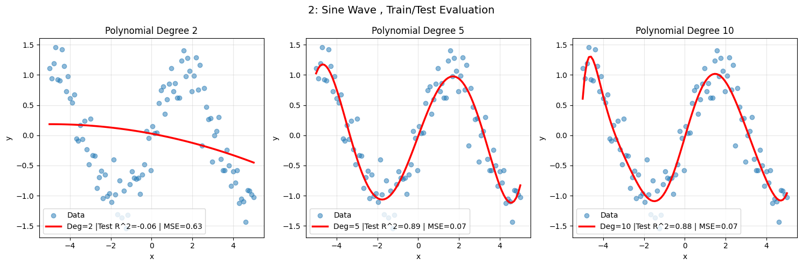
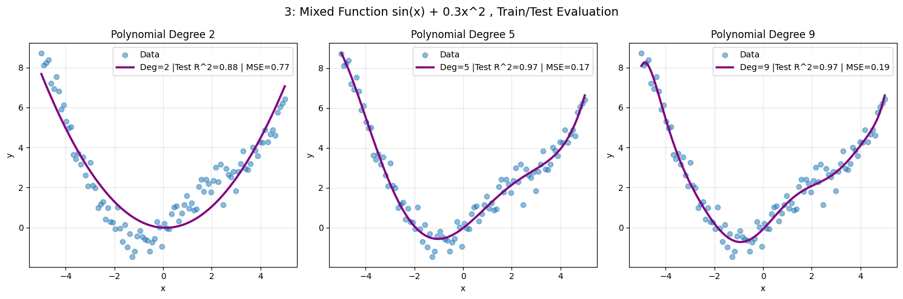
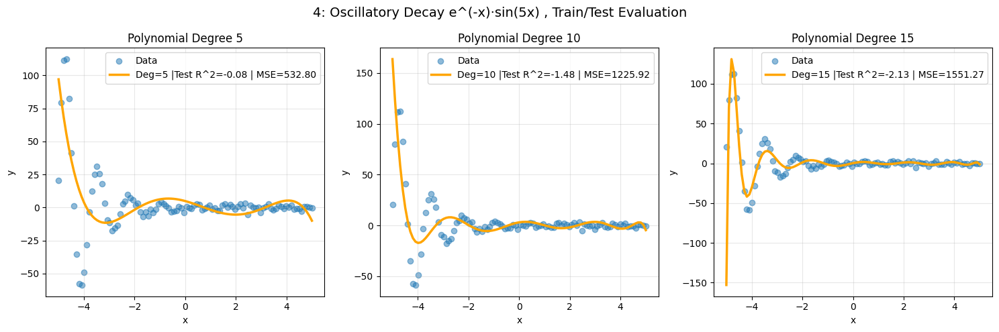
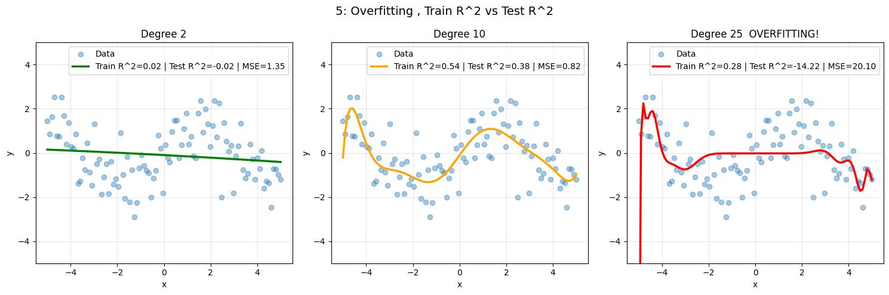

# Beyond Linear Regression
## Can Linear Regression Learn Nonlinear Behavior?


##  Overview

Can a linear model , that fits straight lines , ever capture curved, wavy, or complex patterns?

This project explores that question through **polynomial regression**: an extension of linear regression
that can approximate nonlinear functions by adding polynomial terms (x², x³, ...) as features.

We test 5 progressively harder experiments, measure exactly how well (and when) the model breaks down,
and visualize the critical concept of **overfitting**.

---

##  Preview

### Simple Quadratic Fit


### Sine Wave Approximation


### Mixed Function Approximation


### Oscillatory Decay ( Where Regression Fails )


### Overfitting ( When the Model Goes Crazy )


---

## Experiments & Real Results

| # | Function | Best Degree | Test R² | MSE   | Verdict |
|---|----------|------------|---------|-------|---------|
| 1 | Quadratic — x² | 2          | 0.95    | 2.48  | Perfect fit |
| 2 | Sine wave — sin(x) | 5          | 0.89    | 0.07  | Good fit |
| 3 | Mixed — sin(x) + 0.3x² | 5          | 0.97    | 0.17  | Excellent fit |
| 4 | Oscillatory decay |  —          | -0.08   | 532.8 | Complete failure |
| 5 | Overfitting demo | —          | -14.22  | 20.10 | Complete breakdown |


> **Note:** Negative Test R² means the model performs worse than a simple flat average line (a sign of severe overfitting).

---

## Key Findings

- Polynomial regression **can** learn nonlinear behavior when the function is smooth
- Higher polynomial degree = better training fit, but increases risk of **overfitting**
- Rapidly oscillating or exponentially decaying functions remain **very challenging**
- The degree of the polynomial is a critical **hyperparameter** that must be tuned carefully
- Train/Test split is essential , training R² alone is misleading

---

##  Technologies Used

- Python 3.8+
- NumPy
- Matplotlib
- Scikit-learn

---

##  How to Run

1. Clone the repository:
   ```bash
   git clone https://github.com/parhamDOTnet/BeyondLinearRegression.git
   cd BeyondLinearRegression
   ```

2. Install dependencies:
   ```bash
   pip install -r requirements.txt
   ```

3. Launch the notebook:
   ```bash
   jupyter notebook main.ipynb
   ```

---

##  Project Structure

```
├── main.ipynb                        # Main research notebook
├── requirements.txt                  # Python dependencies
├── README.md                         # Project documentation
└── images/
    ├── simpleQuadratic.png   # Experiment 1 visualization
    ├── sineWave.png   # Experiment 2 visualization
    ├── mixedFunctionSin.png   # Experiment 3 visualization
    ├── oscillatoryDecay.png    # Experiment 4 visualization
    └── overfitting.png       # Experiment 5 visualization
```

---

##  Author

**Parham Moezifar**  
Interested in machine learning, mathematical modeling, and data science.

---

##  License

This project is licensed under the MIT License.